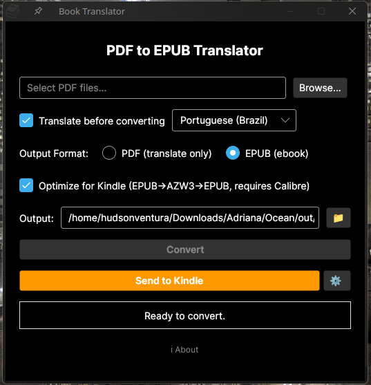
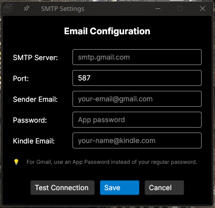

# 📚 PDF to EPUB and Translator with support to Kindle

<p align="center">
  <strong>🔄 Convert • 🌍 Translate • 📖 Read Anywhere</strong>
</p>

<p align="center">
  A muliplatform desktop application that converts PDF books to EPUB format with built-in translation support — perfect for sending to your Kindle!
</p>

---

## ✨ Features

| Feature | Description |
|---------|-------------|
| 📄 **PDF to EPUB Conversion** | Seamlessly convert your PDF books to the popular EPUB format |
| 🌐 **Multi-Language Translation** | Translate your books into multiple languages before conversion |
| 📱 **Send to Kindle** | One-click email your converted books directly to your Kindle device |
| 🎨 **Modern UI** | Beautiful, cross-platform interface built with Avalonia UI |

---

## 🎨 UI

Main Screen  



## 🚀 Getting Started
Go to: https://github.com/hudsonventura/pdf_to_epub_conversor_and_translator/releases  

Download the latest release for your platform and run it.  


## 🚀 Building (if you are a dev)

### Prerequisites

- [.NET 10.0](https://dotnet.microsoft.com/download) or later
- A Kindle device (optional, for the Send to Kindle feature)

### Installation

1. **Clone the repository**
   ```bash
   git clone https://github.com/hudsonventura/pdf_to_epub_conversor_and_translator.git
   cd pdf_to_epub_conversor_and_translator
   ```

2. **Build the project**
   ```bash
   dotnet build
   ```

3. **Run the application**
   ```bash
   dotnet run
   ```

---

## 🚀 Releasing

#### On Linux (AppImage)
```bash
# Make script executable (first time only)
chmod +x build-appimage.sh

# Build AppImage
./build-appimage.sh
```
This creates `BookTranslator-1.0.0-x86_64.AppImage` — a portable, single-file executable that works on any Linux distro.

#### On Windows
```bash
dotnet publish -c Release -r win-x64 --self-contained true -p:PublishSingleFile=true -o ./publish
```

## 📖 How to Use

### Basic Conversion
1. 🖱️ Click **"Browse..."** to select your PDF file
2. ⚡ Click **"Convert to EPUB"** to start the conversion
3. ✅ Your EPUB file will be saved in the output directory
4. 📧 Send the EPUB to your Kindle device via e-mail

### 🌍 Translate Your Books
> **Perfect for reading foreign books in your native language or learning a new language!**

1. ✅ Check the **"Translate before converting"** checkbox
2. 🌐 Select your target language from the dropdown menu
3. 📄 Select your PDF file and convert
4. 🎉 Your book will be translated and converted to EPUB!

### 📱 Send to Kindle
> **Read your translated books on your Kindle device!**

1. 📧 Configure your email settings in ⚙️ button
2. 📄 Convert your PDF to EPUB (with or without translation)
3. 📨 Click **"Send to Kindle"** and select the EPUBs file as you want
4. 📚 Your book will appear in your Kindle library!

---

## ⚙️ Configuration

### Email Settings (for Kindle delivery)

#### For GMail
> ⚠️ **Note:** For **Gmail**, instead of your regular password, you'll need to create a App Password in https://support.google.com/accounts/answer/185833 

To see the Outlook configs, please visit https://support.microsoft.com/en-us/office/pop-imap-and-smtp-settings-for-outlook-com-d088b986-291d-42b8-9564-9c414e2aa040

#### For Outlook
> ⚠️ **Note:** For **Outlook**, instead of your regular password, you'll need to create a App Password in  https://go.microsoft.com/fwlink/?linkid=2274139 

To see the Outlook configs, please visit https://support.microsoft.com/en-us/office/pop-imap-and-smtp-settings-for-outlook-com-d088b986-291d-42b8-9564-9c414e2aa040




---

## 🌐 Supported Languages

The translation feature supports a wide variety of languages including:

| Language | Code | Language | Code |
|----------|------|----------|------|
| 🇺🇸 English | `en-us` | 🇬🇧 English | `en-uk` |
| 🇧🇷 Portuguese | `pt-br` | 🇵🇹 Portuguese | `pt-pt` |
| 🇪🇸 Spanish | `es` | 🇫🇷 French | `fr` |
| 🇩🇪 German | `de` | 🇮🇹 Italian | `it` |
| 🇯🇵 Japanese | `ja` | 🇨🇳 Chinese (Simplified) | `zh` |
| 🇰🇷 Korean | `ko` | 🇷🇺 Russian | `ru` |

*...and many more!*

---

## 🛠️ Tech Stack

| Technology | Purpose |
|------------|---------|
|  | Runtime & Framework |
|  | Cross-Platform UI |
|  | PDF Processing |
|  | EPUB Generation |
|  | Translation Engine |

---

## 📁 Project Structure

```
📦 pdf_to_epub_conversor_and_translator
├── 📂 src
│   ├── 📜 Program.cs              # Application entry point
│   ├── 🪟 MainWindow.axaml        # Main UI window
│   ├── ℹ️ AboutWindow.axaml        # About dialog
│   ├── 📂 Services
│   │   ├── 📄 PdfToMarkdownConverter.cs    # PDF text extraction
│   │   ├── 📕 MarkdownToEpubConverter.cs   # EPUB generation
│   │   ├── 🌐 TranslationService.cs        # Translation logic
│   │   ├── 📧 EmailService.cs              # Kindle email delivery
│   │   └── ⚙️ PreferencesService.cs        # User preferences
│   └── 📂 ViewModels
│       └── 🎛️ MainWindowViewModel.cs       # UI logic
└── 📜 README.md
```

---

## 🤝 Contributing

Contributions are welcome! Feel free to:

1. 🍴 Fork the repository
2. 🌿 Create a feature branch (`git checkout -b feature/amazing-feature`)
3. 💾 Commit your changes (`git commit -m 'Add amazing feature'`)
4. 📤 Push to the branch (`git push origin feature/amazing-feature`)
5. 🔃 Open a Pull Request

---

## 📄 License

This project is open source and available under the [MIT License](LICENSE).

---

## 💡 Tips & Tricks

- 📊 **Large PDFs**: For very large books, translation may take some time. The progress bar will keep you informed!
- 🔤 **Better Results**: PDFs with clean, selectable text produce the best conversion results
- 📧 **Gmail Users**: Remember to enable 2FA and create an App Password for the Send to Kindle feature

---


<p align="center">
  Made with ❤️ for a book lover, my wonderful wife Adriana
</p>

<p align="center">
  ⭐ Star this repo if you find it useful!
</p>
